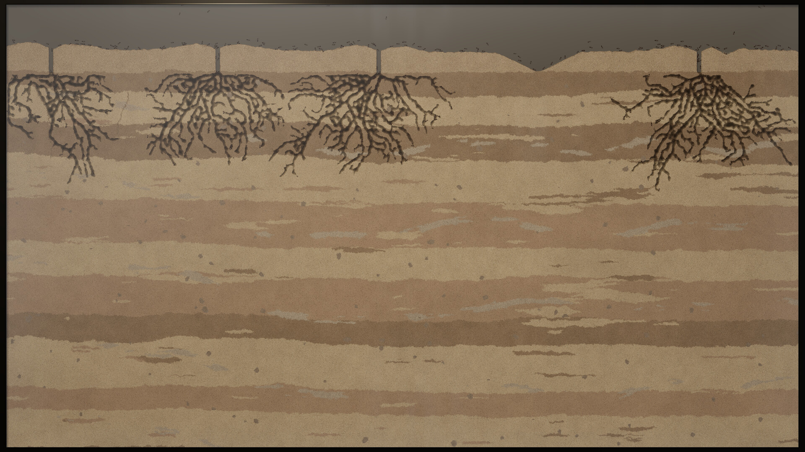

# Shadow Ant Farm

A photorealistic, full-screen glass ant farm for Linux, made to run unattended for a day or more on a stream.
A few hundred workers dig their own nest in layered soil, carry the spoil out to the surface, forage from a
feeding stone the keeper tops up, rest, groom and wander. They do all of it one decision at a time. Nothing about
the tunnels is scripted: every passage is the accumulated result of individual workers choosing where to dig.



- **Native Linux.** Built with Godot 4.7.2-stable (pinned) and a C++ GDExtension. Runs offline and needs no editor.
- **Fresh colony every launch.** Each launch draws a new seed from the operating system; `--seed N` reproduces a
  colony exactly and `--resume` continues the newest checkpoint.
- **350–650 small, anatomical ants**, about 16 px long at 3840 px. Their gait is tied to the distance walked and
  loads are visible in their mandibles.
- **Real excavation.** Work-based digging happens only at exposed faces, with reservations and exact volume
  accounting (excavated = deposited + carried). Spoil forms mounds that slump at a natural angle.
- **Procedural 48 kHz stereo sound** made from simulation events (digging scrapes, crumbling pellets, trickling
  spoil, footfalls). It is voice- and rate-limited and uses no recorded samples.
- **Goes live by itself.** Built-in streaming to YouTube, X or any RTMP server, from the farm's own picture and
  sound (no screen capture). Set the key once; then *Resume and go live* (or `--live`) starts and reconnects on its
  own. With YouTube's Auto-start it's fully hands-off.
- **Stream-safe.** The capture image is clean: no cursor or overlays, and no error pop-ups. The window identity is
  stable, the app keeps running when unfocused, and the screen is kept awake. It never touches the camera or
  microphone. A separate operator window guards the new-colony and quit actions.
- **Long-run safe.** Atomic, versioned, checksummed checkpoints every 10 minutes. Memory and disk use are bounded,
  and logs rotate.

## Install (per user, no root)

From a release: download `shadow-ant-farm-<version>-linux-x86_64.tar.gz` from
[Releases](https://github.com/Shadowfetchapps/shadow-ant-farm/releases), extract it and run
`tools/install.sh` inside the extracted folder.

From source:

```bash
git clone --recursive https://github.com/Shadowfetchapps/shadow-ant-farm.git
cd shadow-ant-farm
GODOT=/path/to/Godot_v4.7.2-stable_linux.x86_64 tools/build.sh
tools/install.sh
```

The build needs CMake ≥ 3.25, a C++20 compiler, and Godot 4.7.2-stable with its export templates. The install
puts the program in `~/.local/opt/shadow-ant-farm`, the launcher in `~/.local/bin/shadow-ant-farm`, and a desktop
entry and icon under `~/.local/share`. Colonies, settings and logs live in `~/.local/share/shadow-ant-farm`.
`tools/uninstall.sh` removes the program but keeps your colonies.

## Run

```bash
shadow-ant-farm                 # a new colony, full screen
shadow-ant-farm --resume        # continue the newest checkpoint
shadow-ant-farm --resume --operator
```

**F2** shows or hides the operator window. **F11** toggles full screen. See [docs/OPERATING.md](docs/OPERATING.md)
for every option, the operator window, checkpoints, the soak test and troubleshooting.

## Documentation

- [Operating guide](docs/OPERATING.md): running it on stream, controls, checkpoints, soak and capture checks
- [Stream description](docs/STREAM.md): ready-to-paste text for the stream page
- [How the colony works](docs/DESIGN.md): the simulation model and the rendering
- [Test report](docs/TESTING.md): what is tested, how, and the latest results
- [Assets and licences](docs/ASSETS.md): provenance of every asset and third-party component

## Repository layout

| Path | What |
|---|---|
| `core/` | Deterministic colony simulation in plain C++ (no engine dependency) |
| `extension/` | GDExtension: the simulation, terrain texture and procedural audio for Godot |
| `game/` | Godot project: presentation, shaders, operator window, checkpoints, command line |
| `tests/` | Core test suite (`antfarm_tests`) |
| `tools/` | `antfarm_sim` (headless accelerated runs and maps), build and install scripts |
| `third_party/godot-cpp` | godot-cpp 10.0.0-stable (submodule) |

## Licence

MIT. See [LICENSE](LICENSE). Third-party components and their licences are listed in [docs/ASSETS.md](docs/ASSETS.md).
