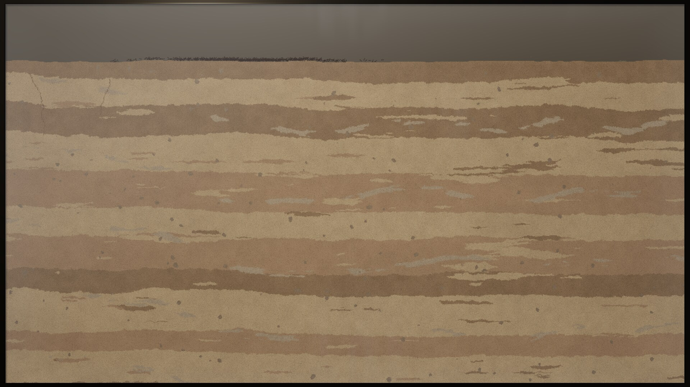
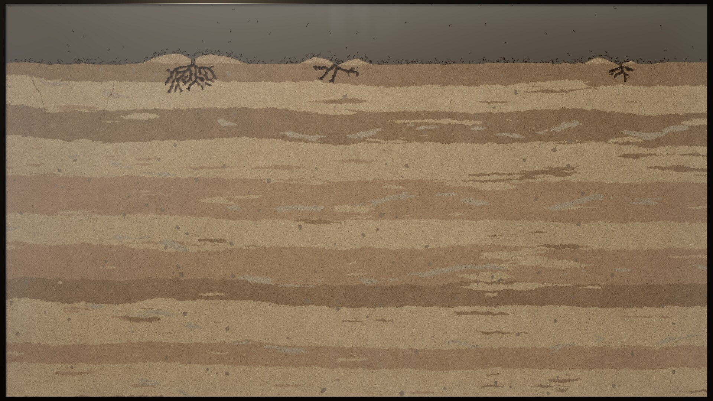
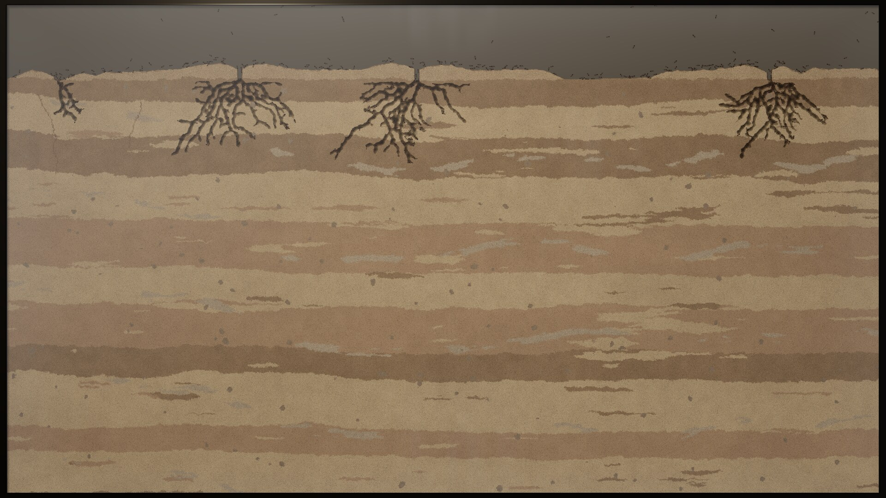
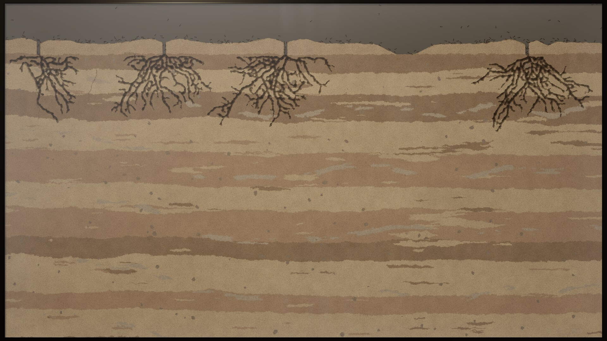
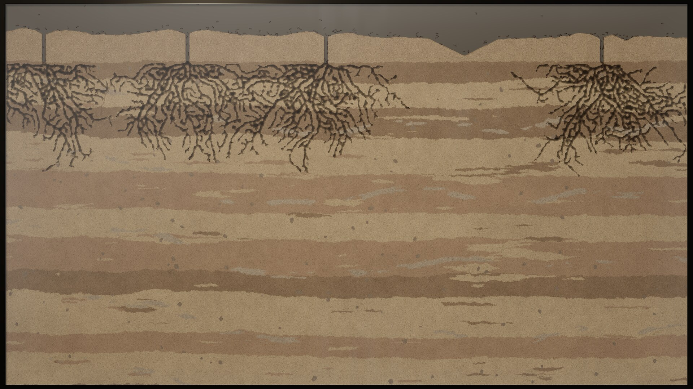
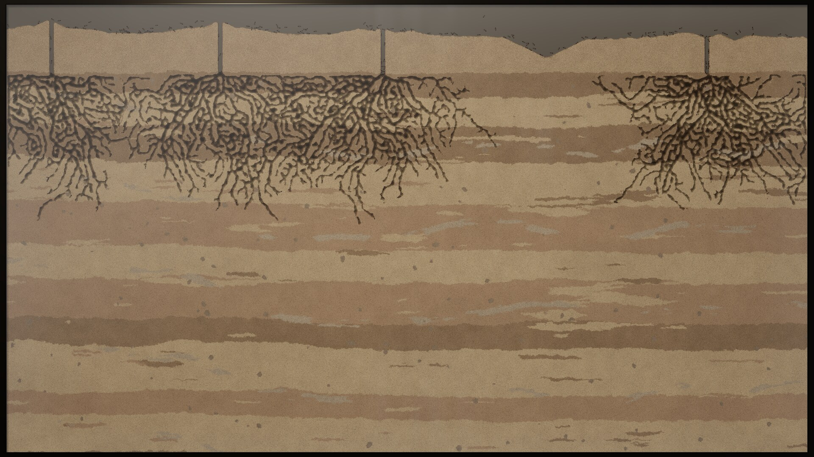
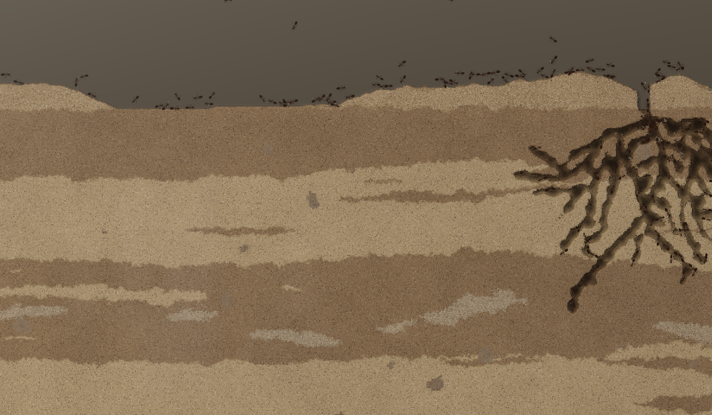

# Test report

Machine: AMD Ryzen 7 5700G, NVIDIA GeForce RTX 5060 Ti, Pop!_OS with the COSMIC desktop (Wayland), Godot
4.7.2-stable. Date: 2026-09-24.

## Summary

| Area | How it is tested | Result |
|---|---|---|
| Fresh seeds | `fresh_seeds`; two launches through the extension draw different OS seeds | Pass |
| Determinism | `determinism`: same seed, same state hash; CLI vs. installed Godot build, same seed, same hash | Pass (`a5ef2d4e6dd90451` from both after 0.5 h) |
| Frame independence | `frame_independence`: 1-tick, varied and 60-tick batches give the same state | Pass |
| Excavation rules and navigation | `excavation_and_navigation`: every removal comes from a face exposed before the tick, within reach of a worker; stone and roots are never removed; no worker is ever inside solid soil | Pass |
| Conservation | `conservation` and every hour of `pacing_24h`: excavated = deposited + carried, exactly | Pass |
| Congestion | `congestion`: longest time any moving worker stays within 2 cells over 3 simulated hours | Pass (worst 40.8 s; limit 120 s) |
| Persistence | `persistence`: checkpoint, restore, continue for 30 minutes, same state hash; a corrupted file is rejected. The installed launcher saves on quit and resumes with `--resume` | Pass |
| 24-hour pacing | `pacing_24h`: three seeds, 24 simulated hours each | Pass (see below) |
| Resource bounds | Simulation memory constant over 24 h (`pacing_24h`); event queue fixed size; checkpoint and log retention bounded | Pass |
| Headless accelerated mode | `--headless-test` through the extension and the exported binary | Pass |
| Capture | Window identity, 4K frame times, encoded-capture check | See below |
| Live streaming | Local RTMP server: picture, sound, sync, reconnect, refused server, keyring | Pass (see below) |
| Real-time 24-hour soak | `--soak 24` | **Not run.** It needs 24 real hours (see the end of this report). |

Run the core suite with `build/antfarm_tests`. It takes about 20 minutes, most of it the three 24-hour pacing
runs; set `ANTFARM_PACING_SEEDS=1` for a quicker pass.

## 24-hour pacing (accelerated, same core)

| Seed | Ants | 10 min | 1 h | 4 h | 8 h | 12 h | 18 h | 24 h | Pellets in hour 24 | Depth | Entrances |
|---|---|---|---|---|---|---|---|---|---|---|---|
| `5eed0000` | 516 | 293 pellets | 0.3% | 1.4% | 2.8% | 4.1% | 6.1% | 8.0% | 1,329 | 190 | 3 |
| `5eed1eef` | 376 | 271 pellets | 0.2% | 0.7% | 1.3% | 1.8% | 2.5% | 3.1% | 450 | 162 | 1 |
| `5eed3dde` | 584 | 212 pellets | 0.2% | 1.3% | 2.9% | 4.3% | 6.3% | 8.3% | 1,438 | 212 | 2 |

The checks run each hour:
- excavated = deposited + carried;
- no growth in simulation memory;
- at most 24 food caches.

At 24 h the checks are: under 50% excavated, over 2.5% excavated, still growing, more than 30 pellets in
hour 24, and deepest passage over 60 cells. The lower bound was 4% during development. It was lowered to 2.5% once
it was clear that single-entrance colonies naturally dig about 3%.

Excavation is visible within minutes of a new colony (200–300 pellets in the first 10 minutes). Over a day it
reaches about 3–10% of the substrate, depending on the seed. Colonies with a single entrance are the slowest,
because all their traffic shares one shaft. Every colony is still digging in hour 24, and most of the soil stays
intact. On long runs the mounds stop growing once they fill about a third of the surface air, because carriers
then backfill disused side passages. In a 36-simulated-hour run the mounds held steady from hour 24 to hour 36
while digging continued.

Inspection colony (seed `0x5eed0001`, 645 ants, `antfarm_sim`):

| Hour | 4 | 8 | 12 | 16 | 20 | 24 |
|---|---|---|---|---|---|---|
| Excavated | 2.0% | 3.9% | 5.6% | 7.2% | 8.9% | 10.5% |
| Deepest passage (cells) | 92 | 123 | 145 | 156 | 166 | 182 |

At 24 h the soil-carrier round trip was 47 s at the median, 107 s at the 90th percentile and 131 s at worst, with
no worker stranded. 3,295 loads had been backfilled and 42,444 deposited on the mounds.

By 24 h the mounds cover a large part of the surface air, and the upper galleries of busy nests are dense. That
matches real ant farms after a day, but it is what a long stream will look like.

## Visual inspection

The stills below were rendered at 3840 × 2160 from checkpoints at 0, 1, 4, 8, 12, 18 and 24 hours of the
inspection colony (`--load … --capture …`), in `docs/images/`.

| 0 h | 1 h | 4 h |
|---|---|---|
|  |  |  |
| **8 h** | **12 h** | **18 h** |
|  |  |  |
| **24 h** | **Close-up (4 h, 1:1 at 4K)** | |
|  |  | |

What was checked, and fixed where needed, during development:

- no grid staircase on tunnel walls or layer boundaries;
- tunnels read as carved passages with a dark interior and a lit lower lip;
- ants are recognisable, with head, gaster, six legs and antennae, and their legs cycle with distance walked;
- loads are visible in the mandibles;
- mounds slump naturally, with the entrance hole kept clear;
- no pale or blue artefacts in the gravel or stones;
- no maze-like thickets from chamber digging.

## Capture and presentation

- **Window identity** (Wayland protocol log): the farm window has `app_id` "Shadow Ant Farm" and title
  "Shadow Ant Farm". The operator window has the same app id and the title "Shadow Ant Farm — Operator".
- **Screen kept awake:** the protocol log shows `zwp_idle_inhibit_manager_v1.create_inhibitor` on the farm's
  surface. The app never opens a camera or a microphone: it makes no capture calls, and audio input is left at
  Godot's default, which is off.
- **Frame times, 4K offscreen render** (`--render-size 3840x2160 --bench 15 --uncapped`, 12 h colony):
  with the frame cap off, a mean of 6.4 ms (156 fps), 99th percentile 9.0 ms, worst 14.5 ms, and no dropped
  ticks. 4K at 60 FPS therefore has about 2.5× headroom on this GPU. The capped 60 FPS and 30 FPS presets couldn't
  be timed meaningfully here, because the display was asleep during testing and the compositor throttles a window
  it isn't showing.
- **Real time while throttled:** with the display asleep, the compositor slowed the farm window to about one
  frame per second. The colony still advanced 44.0 simulated seconds in 43.9 wall seconds with no dropped ticks,
  because the simulation follows the wall clock rather than the frame delta.
- **Terrain rebuild:** the distance field and texture (about 17–19 ms of CPU) run on a worker thread, so they
  never stall a frame. Ant buffers take about 0.01 ms per frame, and a simulation tick about 0.12 ms.
- **Encoded capture:** 10 s recorded with Godot's movie writer (1600 × 900 at 60 FPS),
  scaled to 1080p and encoded with x264 at 6 Mb/s CBR (a typical stream setting). Compared with a near-lossless
  reference:
  - SSIM (luma) 0.988, PSNR 44.9 dB;
  - dark ant pixels in the surface band: 7,464 in the reference and 7,458 after encoding, so the ants survive
    the encode;
  - 6,630 pixels changed by more than 12 levels in 0.5 s, so the ants are moving.
- **Audio** (60 s rendered offline from a 12 h colony):
  - peak −14 dBFS, RMS −40 dBFS, never clipping (soft limiter);
  - stereo correlation 0.47, and the energy sits in the 1–24 kHz grain and scrape range;
  - 35 of 824 events (4%) were dropped by the rate limiter at that level of activity.
- **Operator window:** renders at 560 × 780. It shows status, save buttons, the frame-rate preset, six volume
  sliders and the guarded *new colony* and *quit* actions.

## Live streaming (1.1.0)

Tested against a local RTMP server (`ffmpeg -listen 1 …`, 127.0.0.1), so nothing was broadcast publicly. Each run
used the 12-hour colony, and the display was asleep during testing (X11 display path).

| Check | Result |
|---|---|
| What arrives at the server | H.264 1280×720 at 30 fps, 4.0 Mb/s CBR, a keyframe every 2.0 s; AAC 48 kHz stereo at 128 kb/s |
| Picture | The farm itself: 53 samples over 28 s, mean brightness 116, **0 black** |
| Sound | Present: mean −35 dB, peak −16 dB |
| Timing | 1,138 frames in 37.9 s (30.0 fps), no gaps over 50 ms; video 0.02–37.92 s and audio 0.00–37.95 s (in step) |
| Server drops the connection | It dropped at 8 s. The farm reported *Connection lost* and was **live again 5 s later** without help |
| Server refuses every connection (as with a wrong key or address) | Retried with back-off, then stopped after about 35 s with "The server keeps closing the connection straight away. Check the stream key and the server address…" |
| Cost to the farm | Held a flat 60 fps with no dropped ticks while streaming |
| Keyring | Save, look up and clear a key through `secret-tool`; the test entry was removed afterwards. Starting without a key gives a clear message |
| Live to YouTube or X | **Not tested here:** that needs the user's own stream key, entered by the user |

An earlier build skipped ahead after ffmpeg's start-up stall, which put the sound 1.2 s ahead of the picture. The
writers now catch up instead of skipping, so the picture and sound timelines always equal real time.

## Real-time 24-hour soak

The soak command is `shadow-ant-farm --soak 24` (see [OPERATING.md](OPERATING.md#long-run-and-inspection-tools)).
It writes a health record every real minute and a summary with the elapsed real hours at the end.

**Status: not run for this release.** It takes 24 real hours, with the farm visible on a monitor. Until it has
run the full 24 real hours, a 24-hour soak has **not** passed. The accelerated 24- and 36-hour runs of the same
core above are not a substitute for it.
